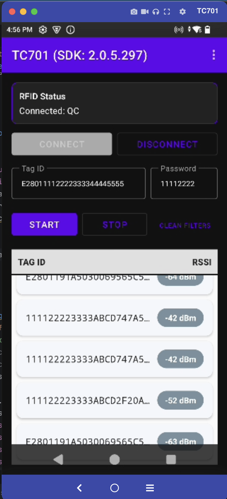

# Zebra RFID SDK Sample (TC701)

This project demonstrates how to integrate the Zebra RFID SDK into an Android application to interact with Zebra RFID readers

## Core Functionalities

- **Initialization**: Setting up the `Readers` instance and choosing the transport layer.
- **Discovery**: Locating available RFID readers via Bluetooth, USB, or Serial.
- **Connection Management**: Connecting and disconnecting from selected readers.
- **Lifecycle Handling**: Foreground initializes and connects the SDK; background disconnects and disposes it.
- **Event Handling**: Responding to reader appearance and disappearance — auto-reconnect when a reader appears, guarded disconnect when the connected reader disappears.
- **USB Cable Plug-in / Unplug**: On the TC701 (RFD40 over serial), plugging in a USB cable preempts the reader link (reader disappears → disconnect); unplugging restores it (reader reappears → reconnect).
- **Inventory & Barcode**: Basic RFID tag inventory and barcode scanning support.

## Getting Started

### Prerequisites
- Zebra RFID SDK AAR (`app/libs/rfidapi3lib-2.0.5.297.aar`) included in the project and pulled in via `fileTree` in [app/build.gradle](app/build.gradle).
- Android 12+ requires Bluetooth permissions (`BLUETOOTH_SCAN`, `BLUETOOTH_CONNECT`).

### Quick Start
1. Initialize the `RFIDHandler` in your Activity.
2. The SDK will automatically attempt to find and connect to a paired reader.
3. Use `performConnect()` and `performDisconnect()` to manage the lifecycle manually.

For detailed design and code snippets, see [design.md](./design.md).

For the activity-lifecycle and reader connect/disconnect flow (including USB cable plug-in / unplug handling), see [lifecycle.md](./lifecycle.md).
