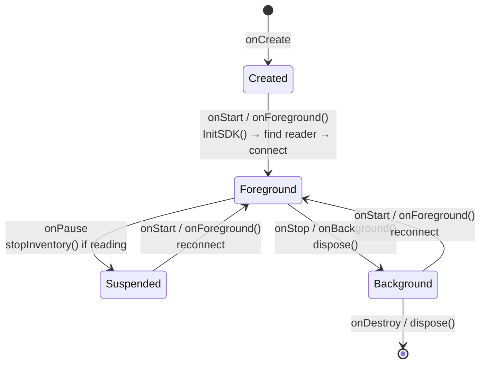
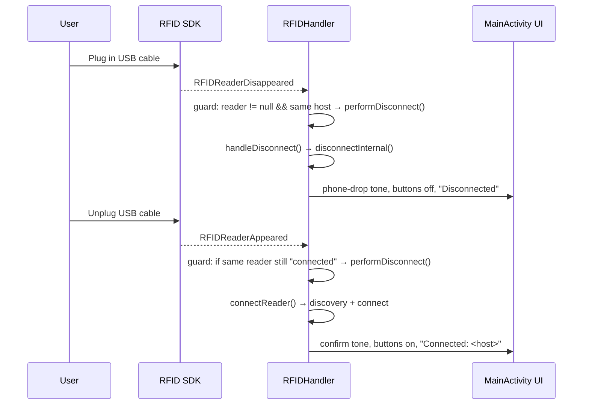

# App Lifecycle & RFID Reader Management

This document describes how the sample app drives the Zebra RFID SDK across the
Android activity lifecycle: **SDK initialization**, **reader discovery**,
**background disconnect / dispose**, **suspend disconnect**,
**resume reconnect**, and **USB cable plug-in / unplug** (reader disappear /
reappear + auto-reconnect).

The two collaborating classes are:

- [`MainActivity`](app/src/main/java/com/zebra/rfid/demo/sdksample/MainActivity.java) — owns the UI and the Android lifecycle callbacks. It forwards lifecycle transitions to the handler.
- [`RFIDHandler`](app/src/main/java/com/zebra/rfid/demo/sdksample/RFIDHandler.java) — owns the `Readers` / `RFIDReader` SDK objects and all connect / disconnect / dispose logic.

## Design principle

The app treats **foreground = live SDK** and **background = no SDK**:

- When the app becomes visible it fully **initializes the SDK, finds the reader, and connects**.
- When the app leaves the screen it **disconnects, cleans up, and disposes** the SDK so no reader session or native resources are held while backgrounded.

This keeps the reader available to other apps while this one is not in use, and
guarantees a clean, well-defined reconnect every time the user returns.

## Lifecycle map

| Android callback (`MainActivity`) | Handler call (`RFIDHandler`) | Effect |
| --- | --- | --- |
| `onCreate` | *(none — only wires views & requests permission)* | Prepares UI, sets `rfidPermissionReady` |
| `onStart` (foreground) | `onForeground(this)` → `onCreate(...)` → `InitSDK()` | Init SDK, find reader, connect |
| `onPostResume` | *(none — just refreshes title/status)* | Clears status buffer, updates title |
| `onPause` (partial suspend) | `stopInventory()` (only if reading) | Stops an in-flight inventory |
| `onStop` (background) | `onBackground()` → `dispose()` | Disconnect + clean + dispose |
| `onDestroy` | `onDestroy()` → `dispose()` | Final cleanup |



> Events that are **independent of the activity lifecycle** — reader-initiated
> disconnects and USB cable plug-in / unplug — are covered in sections 6 and 7.

---

## 1. Permission gate (before any SDK use)

The reader transports need Bluetooth permissions on Android 12+. `onCreate` does
**not** initialize the SDK directly; it only records whether permission is
available via `rfidPermissionReady`. Actual initialization is always driven by
`onStart` (see section 2).

```java
// MainActivity.onCreate(...)
if (Build.VERSION.SDK_INT >= Build.VERSION_CODES.S) {
    if (ContextCompat.checkSelfPermission(this, Manifest.permission.BLUETOOTH_CONNECT) != PackageManager.PERMISSION_GRANTED) {
        requestPermissionLauncher.launch(new String[]{Manifest.permission.BLUETOOTH_SCAN, Manifest.permission.BLUETOOTH_CONNECT});
    } else {
        rfidPermissionReady = true;
    }
} else {
    rfidPermissionReady = true;
}
```

Because the permission dialog resolves **after** `onStart` has already run, the
grant callback must kick off initialization itself:

```java
// MainActivity — permission result callback
private final ActivityResultLauncher<String[]> requestPermissionLauncher =
        registerForActivityResult(new ActivityResultContracts.RequestMultiplePermissions(), result -> {
            Boolean bluetoothConnect = result.getOrDefault(Manifest.permission.BLUETOOTH_CONNECT, false);
            if (Boolean.TRUE.equals(bluetoothConnect)) {
                rfidPermissionReady = true;
                rfidHandler.onForeground(this);   // permission arrived after onStart → init now
            } else {
                Toast.makeText(this, R.string.permission_not_granted, Toast.LENGTH_SHORT).show();
            }
        });
```

---

## 2. Foreground: init SDK, find reader, connect

`onStart` fires every time the activity becomes visible (cold start and every
return from background). Guarded by the permission flag, it asks the handler to
enter the foreground state.

```java
// MainActivity.onStart()
@Override
protected void onStart() {
    super.onStart();
    Log.d(TAG, "onStart");
    if (rfidPermissionReady) {
        rfidHandler.onForeground(this);
    }
}
```

`onForeground` re-establishes handler references and (re)creates the
`ToneGenerator` if it was released by a prior `dispose()`, then calls `InitSDK()`:

```java
// RFIDHandler
void onForeground(MainActivity activity) {
    onCreate(activity);
}

void onCreate(MainActivity activity) {
    context = activity;
    textView = activity.statusTextViewRFID;
    scannerList = new ArrayList<>();
    if (toneGenerator == null) {                 // recreated after a background dispose
        try {
            toneGenerator = new ToneGenerator(AudioManager.STREAM_NOTIFICATION, 100);
        } catch (Exception e) {
            Log.e(TAG, "Failed to initialize ToneGenerator", e);
        }
    }
    InitSDK();
    context.updateTitleWithSdkVersion(getVersionInfo());
}
```

### 2a. `InitSDK()` — create the `Readers` instance or reconnect

If the SDK was disposed (`readers == null`), it shows progress, sets a transient
status (`Connecting...` on first launch, `Reconnecting...` afterwards) and builds
a fresh `Readers` instance on a background thread. If the instance still exists,
it simply reconnects.

```java
// RFIDHandler.InitSDK()
private void InitSDK() {
    Log.d(TAG, "InitSDK");
    IRFIDLogger.getLogger("sample app").EnableDebugLogs(true);
    if (readers == null) {
        context.showProgress(true);
        context.setRfidStatus(hasConnectedBefore ? "Reconnecting..." : "Connecting...");
        executorService.execute(this::createInstance);
    } else {
        performConnect();
    }
}
```

### 2b. `createInstance()` — find the reader across transports

Reader discovery tries a series of transports (BLUETOOTH → SERVICE_SERIAL →
SERVICE_USB → QC_SERIAL → RE_SERIAL), stopping as soon as
`GetAvailableRFIDReaderList()` returns a non-empty list.

```java
// RFIDHandler.createInstance() — transport probing (abridged)
readers = new Readers(context, ENUM_TRANSPORT.BLUETOOTH);
availableRFIDReaderList = readers.GetAvailableRFIDReaderList();

if (availableRFIDReaderList.isEmpty()) {
    readers.setTransport(ENUM_TRANSPORT.SERVICE_SERIAL);
    transport = ENUM_TRANSPORT.SERVICE_SERIAL;
    availableRFIDReaderList = readers.GetAvailableRFIDReaderList();
}
// ... SERVICE_USB, QC_SERIAL, RE_SERIAL fallbacks follow the same pattern ...

if (!availableRFIDReaderList.isEmpty()) {
    Log.d(TAG, "Found Reader, Size=" + availableRFIDReaderList.size());
    Log.d(TAG, "Init OK for Transport = " + transport.toString());
}
```

The result is then applied on the UI thread. If discovery failed or no reader was
found, the UI is reset to the disconnected state; otherwise it proceeds to
connect.

```java
// RFIDHandler.createInstance() — result handling
context.runOnUiThread(() -> {
    if (finalException != null) {
        context.sendToast(context.getString(R.string.status_failed_get_readers) + "\n" + finalException.getInfo());
        readers = null;
        context.showProgress(false);
        context.setConnectionButtons(false);
    } else if (availableRFIDReaderList.isEmpty()) {
        context.sendToast(context.getString(R.string.status_no_readers));
        textView.setText("No Reader Found\r\nPower on Reader or Attach");
        readers = null;
        context.showProgress(false);
        context.setConnectionButtons(false);
    } else {
        connectReader();
    }
});
```

### 2c. `GetAvailableReader()` — pick the reader device

When connecting, the handler selects the reader: if exactly one is available it
uses it, otherwise it matches by `readerName`.

```java
// RFIDHandler.GetAvailableReader() (abridged)
readers.attach(this);
ArrayList<ReaderDevice> availableReaders = readers.GetAvailableRFIDReaderList();
if (availableReaders != null && !availableReaders.isEmpty()) {
    availableRFIDReaderList = availableReaders;
    if (availableRFIDReaderList.size() == 1) {
        readerDevice = availableRFIDReaderList.get(0);
        reader = readerDevice.getRFIDReader();
    } else {
        for (ReaderDevice device : availableRFIDReaderList) {
            if (device.getName().startsWith(readerName)) {
                readerDevice = device;
                reader = readerDevice.getRFIDReader();
            }
        }
    }
    if (impinjExtensions == null)
        impinjExtensions = new ImpinjExtensions(reader);
}
```

### 2d. `connectReader()` / `handleConnect()` — establish the session

```java
// RFIDHandler.connectReader()
private synchronized void connectReader() {
    if (!isReaderConnected()) {
        context.showProgress(true);
        executorService.execute(this::connectionTask);
    }
}
```

`connectionTask()` runs discovery + connect, handles the
`RFID_READER_REGION_NOT_CONFIGURED` case, configures the reader, then updates the
UI (status text + CONNECT/DISCONNECT button state) with the final result.

```java
// RFIDHandler.connectionTask() — final UI update
final String result = res;
context.runOnUiThread(() -> {
    textView.setText(result);
    context.UpdateUI_statusTextViewRFID(result);
    context.showProgress(false);
    context.setConnectionButtons(result != null && result.startsWith("Connected"));
});
```

```java
// RFIDHandler.handleConnect() — actual connect call
if (!reader.isConnected()) {
    reader.connect();
}
if (reader.isConnected()) {
    hasConnectedBefore = true;                 // flips future status text to "Reconnecting..."
    playTone(ToneGenerator.TONE_SUP_CONFIRM);  // confirmation beep
    return "Connected: " + reader.getHostName();
}
```

---

## 3. Suspend: `onPause` stops an in-flight inventory

`onPause` is a *partial* suspend (e.g. a dialog or the recents overlay appears).
The app does **not** disconnect here; it only stops an active inventory so no read
is left running while the activity is not resumed.

```java
// MainActivity.onPause()
@Override
protected void onPause() {
    if (rfidHandler.isbIsReading())
        rfidHandler.stopInventory();
    super.onPause();
    Log.d(TAG, "onPause");
}
```

---

## 4. Background: `onStop` disconnects, cleans up, disposes

When the activity is no longer visible, the app tears the SDK down completely.

```java
// MainActivity.onStop()
@Override
protected void onStop() {
    rfidHandler.onBackground();
    super.onStop();
    Log.d(TAG, "onStop");
}
```

```java
// RFIDHandler
void onBackground() {
    dispose();
}
```

`dispose()` disconnects the reader, releases the `ToneGenerator`, clears the
Impinj extension, nulls the reader, and disposes the `Readers` instance so
`readers == null` — which is exactly the condition `InitSDK()` uses on the next
foreground to know it must rebuild the SDK from scratch.

```java
// RFIDHandler.dispose()
private synchronized void dispose() {
    disconnectInternal();
    try {
        if (toneGenerator != null) {
            toneGenerator.release();
            toneGenerator = null;
        }
        impinjExtensions = null;
        if (reader != null) {
            reader = null;
            readers.Dispose();
            readers = null;
        }
    } catch (Throwable e) {
        e.printStackTrace();
    }
}
```

`disconnectInternal()` performs the low-level teardown: it removes the event
listener, terminates the scanner session, and disconnects the reader, swallowing
the SDK exceptions that can occur while tearing down.

```java
// RFIDHandler.disconnectInternal() (abridged)
if (reader != null) {
    if (eventHandler != null)
        reader.Events.removeEventsListener(eventHandler);
    if (sdkHandler != null) {
        sdkHandler.dcssdkTerminateCommunicationSession(scannerID);
        scannerList = null;
    }
    try {
        reader.disconnect();
    } catch (OperationFailureException ofe) {
        Log.d(TAG, "OperationFailureException ofe=" + ofe.getVendorMessage());
    } catch (Throwable e1) {
        Log.d(TAG, "Exception/Error e=" + e1.getMessage());
    }
    context.sendToast("Disconnecting reader");
}
```

---

## 5. Resume: reconnect

Returning from background (or from a partial suspend) fires `onStart` again, which
calls `onForeground(this)` → `InitSDK()`. Because `dispose()` set
`readers == null`, `InitSDK()` rebuilds the `Readers` instance, re-runs transport
discovery, and reconnects — showing **"Reconnecting..."** (since `hasConnectedBefore`
is now `true`) followed by **"Connected: <host>"**.

This is the same code path as the initial foreground connect (section 2); the only
difference is the status wording driven by `hasConnectedBefore`.

---

## 6. Unsolicited disconnects (reader-initiated)

Independent of the activity lifecycle, the reader can drop the link (power off,
out of range, cable removed). The SDK reports this via a status event, which routes
to the same `handleDisconnect()` cleanup used elsewhere.

```java
// RFIDHandler.EventHandler.eventStatusNotify(...)
if (rfidStatusEvents.StatusEventData.getStatusEventType() == STATUS_EVENT_TYPE.DISCONNECTION_EVENT) {
    executorService.execute(RFIDHandler.this::handleDisconnect);
}
```

The reader-appear/disappear callbacks (from `Readers.RFIDReaderEventHandler`)
provide auto-reconnect when the reader shows up on a transport again:

```java
// RFIDHandler
@Override
public void RFIDReaderAppeared(ReaderDevice readerDevice) {
    Log.d(TAG, "RFIDReaderAppeared " + readerDevice.getName());
    context.sendToast("Reader appeared: " + readerDevice.getName());
    if (reader != null && reader.isConnected()) {
        context.sendToast("Reader in USB host mode");
        if (readerDevice.getName().equals(reader.getHostName()))
            performDisconnect();         // same reader re-announced → drop the stale session first
    }
    connectReader();                     // (re)connect to the reader that just appeared
}

@Override
public void RFIDReaderDisappeared(ReaderDevice readerDevice) {
    Log.d(TAG, "RFIDReaderDisappeared " + readerDevice.getName());
    context.sendToast("Reader disappeared: " + readerDevice.getName());
    // Only tear down if the reader that vanished is the one we are connected to.
    if (reader != null && readerDevice.getName().equals(reader.getHostName()))
        performDisconnect();
}
```

---

## 7. USB cable plug-in / unplug (TC701 + RFD40 in a cradle)

On the TC701 the RFD40 reader is reached over a **serial transport**
(`SERVICE_SERIAL`), *not* over the device's USB port. Plugging a USB cable into
the TC701 (for example, to charge or to connect to a host PC) flips the USB role
and **preempts the serial link to the reader**, so the SDK raises a
`RFIDReaderDisappeared` event. Removing the cable frees the link again and the
SDK raises a `RFIDReaderAppeared` event.

The handler is written so this happens automatically, with no user action:

| Physical event | SDK callback | Handler behavior |
| --- | --- | --- |
| **USB cable plugged in** → reader link preempted | `RFIDReaderDisappeared` (and/or `DISCONNECTION_EVENT`) | `RFIDReaderDisappeared` calls `performDisconnect()` for the matching host, which runs `handleDisconnect()` → `disconnectInternal()`, plays the "phone drop" tone, greys out the buttons and shows **"Disconnected"**. If a `DISCONNECTION_EVENT` also fires it funnels into the same synchronized `handleDisconnect()`. |
| **USB cable unplugged** → reader link restored | `RFIDReaderAppeared` | `connectReader()` re-runs discovery + connect and shows **"Connected: &lt;host&gt;"** again. |

### Why the disconnect is guarded

`RFIDReaderDisappeared` only tears down when the reader that vanished is the one
this app is actually connected to:

```java
if (reader != null && readerDevice.getName().equals(reader.getHostName()))
    performDisconnect();
```

Two reasons for the guard:

1. **Null-safety.** After a previous teardown `reader` can already be `null`;
   dereferencing `reader.getHostName()` unconditionally would throw a
   `NullPointerException`. The `reader != null` check prevents that.
2. **Ignore unrelated readers.** A disappear event for a *different* device must
   not drop our live session; the host-name match scopes the teardown to our own
   reader.

`performDisconnect()` hands off to the **synchronized** `handleDisconnect()`, so
if a `DISCONNECTION_EVENT` (section 6) races with the disappear callback the two
are serialized rather than interleaved.

### The "same reader reappears while still connected" guard

When the cable is removed, the reader can be re-announced *before* the stale
session from the previous connection has been fully cleaned up. The guard inside
`RFIDReaderAppeared` handles that case:

```java
if (reader != null && reader.isConnected()) {
    context.sendToast("Reader in USB host mode");
    if (readerDevice.getName().equals(reader.getHostName()))
        performDisconnect();   // drop the stale session before reconnecting
}
connectReader();
```

If the *same* host name reappears while we still think we are connected, the
handler disconnects first (clearing the dead session) and then `connectReader()`
establishes a fresh one. If a *different* reader appears, it simply connects to it.

### Sequence



> **Note (edge cases to watch):**
> - If `connectReader()` fires before the serial port is fully released after
>   unplugging, the connect can fail. `connectReader()` is idempotent
>   (`if (!isReaderConnected())`), so a subsequent `RFIDReaderAppeared` /
>   `RFIDReaderAppeared`-triggered retry will reconnect cleanly.
> - Debounce rapid plug/unplug cycles if you see overlapping connect/disconnect
>   toasts — each physical transition can emit paired appear/disappear events.
```

`handleDisconnect()` is the single funnel for every disconnect (lifecycle,
user-initiated, or reader-initiated). It tears down the session, plays the
"phone drop" beep, and updates the UI to the disconnected state.

```java
// RFIDHandler.handleDisconnect()
private synchronized void handleDisconnect() {
    disconnectInternal();
    playPhoneDropTone();
    context.setConnectionButtons(false);
    context.UpdateUI_statusTextViewRFID("Disconnected");
}
```

---

## Summary

- **Init SDK** — `onStart` → `onForeground()` → `InitSDK()` builds the `Readers` instance on a background thread (gated by Bluetooth permission).
- **Find reader** — `createInstance()` probes transports (BLUETOOTH → SERVICE_SERIAL → SERVICE_USB → QC_SERIAL → RE_SERIAL); `GetAvailableReader()` selects the device.
- **Suspend disconnect** — `onPause` only stops an active inventory; the connection is kept.
- **Background disconnect** — `onStop` → `onBackground()` → `dispose()` fully disconnects, cleans up, and releases the SDK (`readers == null`).
- **Resume reconnect** — `onStart` runs again; since `readers == null`, `InitSDK()` rebuilds and reconnects, showing "Reconnecting..." → "Connected".
- **Reader-initiated disconnects** and **auto-reconnect** funnel through `handleDisconnect()` / `connectReader()`, sharing the lifecycle code paths.
- **USB cable plug-in / unplug** — `RFIDReaderDisappeared` actively disconnects the matching reader (guarded by `reader != null` + host-name match); `RFIDReaderAppeared` reconnects it. See section 7.
