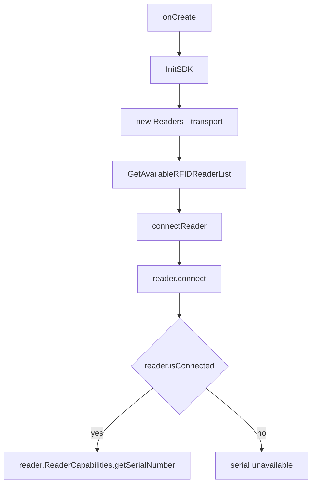

# App Note: Reading the Reader Serial Number

How to retrieve the RFID reader's serial number with the Zebra RFID SDK, from
initializing the SDK through connecting the reader to reading the value.

The serial number lives in `reader.ReaderCapabilities` and is only valid **after**
the reader is connected. The full path is: init SDK → discover readers → connect →
read `ReaderCapabilities.getSerialNumber()`.

---

## 1. Overview of the flow



Key point: `getSerialNumber()` returns `null`/empty until the reader is connected,
because `ReaderCapabilities` is populated by the connect handshake.

---

## 2. Initialize the SDK

Initialization creates the `Readers` object and enumerates available transports.
See `RFIDHandler.InitSDK()` and `RFIDHandler.createInstance()`.

```java
private void InitSDK() {
    IRFIDLogger.getLogger("sample app").EnableDebugLogs(true);
    if (readers == null) {
        context.showProgress(true);
        executorService.execute(this::createInstance);   // off the UI thread
    } else {
        performConnect();
    }
}
```

`createInstance()` builds `Readers` and tries each transport until a reader is found:

```java
readers = new Readers(context, ENUM_TRANSPORT.BLUETOOTH);
availableRFIDReaderList = readers.GetAvailableRFIDReaderList();
// falls back through BLUETOOTH -> SERVICE_SERIAL -> SERVICE_USB -> QC_SERIAL -> RE_SERIAL
```

When at least one reader is found, the sample proceeds to `connectReader()`.

> Note: `new Readers(...)` and `GetAvailableRFIDReaderList()` are blocking calls.
> Run them on a background thread (the sample uses an `ExecutorService`), never on
> the UI thread.

---

## 3. Select and connect the reader

`GetAvailableReader()` picks the reader (single reader auto-selected, otherwise
matched by name) and obtains the `RFIDReader` instance:

```java
readerDevice = availableRFIDReaderList.get(0);
reader = readerDevice.getRFIDReader();
```

`handleConnect()` opens the connection:

```java
if (!reader.isConnected()) {
    reader.connect();               // handshake populates ReaderCapabilities
}
if (reader.isConnected()) {
    return "Connected: " + reader.getHostName();
}
```

Only after `reader.isConnected()` returns `true` is `ReaderCapabilities` valid.

---

## 4. Read the serial number

Once connected, read the serial number from `ReaderCapabilities`. See
`RFIDHandler.getSerialNumber()`:

```java
public String getSerialNumber() {
    try {
        if (reader != null && reader.isConnected() && reader.ReaderCapabilities != null) {
            String serial = reader.ReaderCapabilities.getSerialNumber();
            Log.d(TAG, "ReaderCapabilities serial='" + serial + "'");
            return serial;
        }
        Log.d(TAG, "Reader not connected; cannot read serial number");
    } catch (Exception e) {
        Log.e(TAG, "Failed to read serial number from reader capabilities", e);
    }
    return null;   // not connected or capabilities unavailable
}
```

Guard conditions, in order:

1. `reader != null` — SDK initialized and a reader selected.
2. `reader.isConnected()` — connection established.
3. `reader.ReaderCapabilities != null` — capabilities populated.

If any check fails, the method returns `null` so the caller can show a fallback.

---

## 5. Call it from the UI

The menu handler in `MainActivity` reads the serial and shows a dialog,
substituting a fallback message when the value is missing:

```java
String serial = rfidHandler.getSerialNumber();
String message = (serial == null || serial.trim().isEmpty())
        ? getString(R.string.oem_serial_unavailable)
        : getString(R.string.oem_serial_label, serial);
new MaterialAlertDialogBuilder(this)
        .setTitle(R.string.oem_serial_title)
        .setMessage(message)
        .setPositiveButton(android.R.string.ok, null)
        .show();
```

---

## 6. Checklist / troubleshooting

- Serial is `null`/empty → the reader is not connected yet. Ensure connect
  succeeded before calling `getSerialNumber()`.
- Bluetooth readers on Android 12+ require `BLUETOOTH_SCAN` and `BLUETOOTH_CONNECT`
  runtime permissions before `InitSDK()` can discover the device.
- Never call the discovery/connect APIs on the UI thread; keep them on a worker
  thread as the sample does.
- `ReaderCapabilities` also exposes other device info (model, firmware, supported
  regions) using the same connected precondition.
